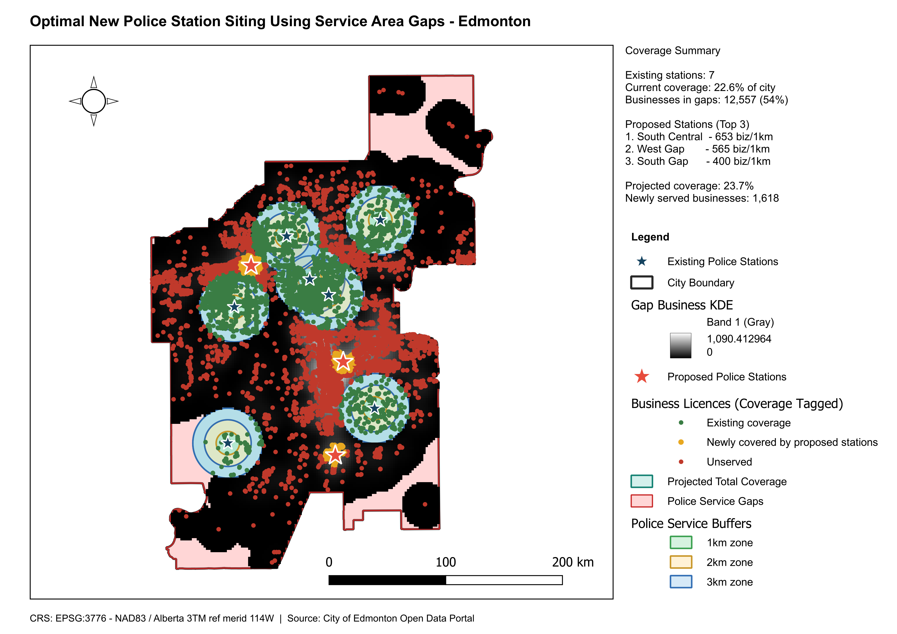

# Optimal New Police Station Siting Using Service Area Gaps

**City:** Edmonton, Alberta, Canada
**CRS:** EPSG:3776 - NAD83(CSRS) / Alberta 3TM ref merid 114W
**Project file:** `Optimal_Police_Station_Siting.qgz`

---

## Overview

This project identifies optimal locations for new police stations in Edmonton by analysing service area gaps left by the existing station network. Existing police service buffers are subtracted from the city area to delineate gap zones, and a Kernel Density Estimation (KDE) of business licence locations within those gaps is used to identify demand-weighted hotspots. Proposed new station sites are placed at the centroid of the highest-density gap hotspots, maximising coverage gain per new facility.

## Reference Layout

---

## Objectives

- Define service coverage buffers around all existing police stations.
- Identify spatial service gaps within Edmonton's city boundary.
- Apply KDE on business licence locations within gap zones to surface demand hotspots.
- Derive proposed new station locations from hotspot centroids.
- Project total coverage gain from proposed new stations.

## Methodology

1. Existing police station locations loaded and service area buffers generated: `police_service_buffers.gpkg`; covered area extracted as `police_covered_area.gpkg`.
2. Service gaps computed by differencing covered area from city boundary: `police_service_gaps.gpkg`.
3. Business licences clipped to gap zones: `businesses_in_gaps.gpkg`; businesses within existing coverage retained as reference: `businesses_served.gpkg`.
4. KDE raster generated from business locations within gap zones (raw density, metric units): `gap_business_kde.tif`; raster clipped to city boundary: `gap_kde_clipped.tif`.
5. KDE raster binarised to isolate hotspot cells above a density threshold: `kde_hot_binary.tif`.
6. Hotspot polygons vectorised from binary raster, filtered by minimum area: `kde_hotspot_polys.gpkg`, `kde_hotspot_filtered.gpkg`.
7. Hotspot centroids computed as proposed station locations: `hotspot_centroids.gpkg`; centroid points stored as `proposed_police_stations.gpkg`.
8. New service buffers generated around proposed stations: `proposed_station_buffers.gpkg`.
9. Existing and proposed coverage merged to project total coverage: `merged_coverage.gpkg`, `total_coverage_projected.gpkg`.
10. Business licence coverage re-tagged against total projected coverage: `business_licences_coverage_tagged.gpkg`.

## Output Layers

| File | Description |
|------|-------------|
| `police_stations.gpkg` | Existing police station locations |
| `police_service_buffers.gpkg` | Service area buffers around existing stations |
| `police_covered_area.gpkg` | Dissolved coverage polygon for existing stations |
| `police_service_gaps.gpkg` | Service gap zones (city area minus existing coverage) |
| `businesses_in_gaps.gpkg` | Business licences within service gap zones |
| `businesses_served.gpkg` | Business licences within existing service coverage |
| `business_licences_coverage_tagged.gpkg` | All business licences tagged with projected coverage status |
| `gap_business_kde.tif` | KDE raster of business licence density within gap zones |
| `gap_kde_clipped.tif` | KDE raster clipped to city boundary |
| `kde_hot_binary.tif` | Binary raster isolating KDE hotspot cells |
| `kde_hotspot_polys.gpkg` | Vectorised hotspot polygons from binary raster |
| `kde_hotspot_filtered.gpkg` | Hotspot polygons filtered by minimum area threshold |
| `hotspot_centroids.gpkg` | Centroids of filtered hotspot polygons |
| `proposed_police_stations.gpkg` | Proposed new police station locations |
| `proposed_station_buffers.gpkg` | Service area buffers around proposed stations |
| `merged_coverage.gpkg` | Combined existing and proposed coverage areas |
| `total_coverage_projected.gpkg` | Projected total coverage after new station deployment |
| `city_boundary.gpkg` | Edmonton city boundary |

## Key Findings

- Existing police stations leave identifiable service gaps in Edmonton's outer suburban and industrial zones where business licence density is non-trivial.
- KDE-weighted hotspot analysis surfaces discrete demand clusters within gap zones, yielding specific and justified siting recommendations rather than arbitrary placements.
- The proposed station locations and projected coverage layer quantify the coverage gain achievable from each new facility, supporting budget-constrained capital planning.

## Deliverables

| File | Type |
|------|------|
| `Optimal_Police_Station_Siting.qgz` | QGIS project |
| `Optimal_Police_Station_Siting.pdf` | Exported map layout |
| `reference_layout.png` | Print layout reference image |

## Notes

- All layers use EPSG:3776 (NAD83(CSRS) / Alberta 3TM ref merid 114W).
- Business licences are used as a demand proxy; population density or incident data would provide a complementary or alternative demand surface depending on the planning objective.

---

## Map Preview

